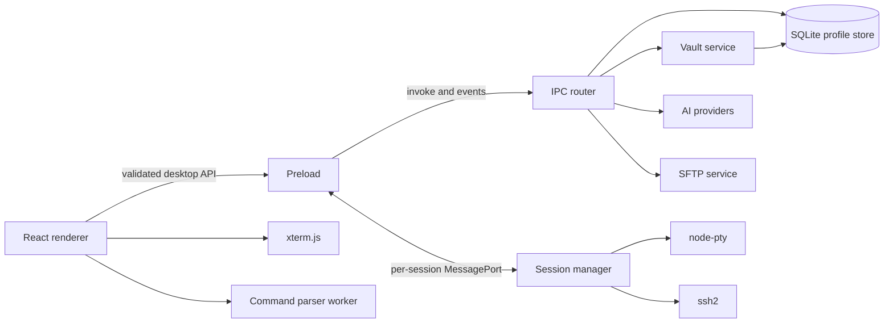

# Geared Term Implementation Plan

> Status: In progress; foundation milestone implemented
>
> Last updated: 2026-09-19
>
> Governing specification: [`SPEC.md`](SPEC.md)

## 1. Objective and stop condition

This plan describes how Geared Term is delivered as a standalone Electron desktop terminal while
keeping the application usable, testable, and auditable at each stage. It is the execution record
for the governing specification and is updated as each vertical slice lands.

The project has no relationship to any other application and carries no compatibility obligations
for foreign data formats. Behavior is defined solely by `SPEC.md`.

Delivery stops only when the initial release passes the definition of done in `SPEC.md` Section 25,
including the requirements matrix, packaged smoke tests, and the storage acceptance suites.

### 1.1 Current implementation checkpoint

The foundation milestone is complete. It includes the pnpm workspace, validated protocol and domain
packages, conservative command parsing, secure Electron process boundaries, local PTY transport with
bounded flow control, SSH host-key verification, SFTP primitives, WSL discovery, encrypted vault
storage, atomic JSON persistence, provider-neutral AI streaming, diagnostic logging, and a minimal
React/xterm renderer. Subsequent checkpoints added, in order: persisted window bounds, saved local
profile CRUD, sidebar collapse state, and multiple independent terminal tabs; validated WSL
discovery and launch tabs with main-process-only resolution of vault-backed SSH credentials;
vault-referenced AI connections, cancellable provider-neutral streaming, and a bounded assistant
panel; conservative top-level command splitting with whole-block fallback; persisted terminal
settings and English/Simplified-Chinese settings labels; an independent SFTP channel on SSH sessions
with validated remote listing in a capability-gated panel; bounded local/WSL environment probes with
versioned, editable environment records; content revisions, explicit command cards, and a validated
main-process Insert/Run action path; conservative destructive-command classification and explicit
environment-context attachment with a renderer-visible preview; a session profile editor for local,
WSL, and SSH targets with vault lifecycle controls; a non-persistent SSH connection dialog;
main-owned local file dialogs for SFTP transfers; the persisted split-command presentation setting;
and named/ungrouped profile sidebar sections.

## 2. Delivery rules

1. Deliver behavior in vertical slices; keep each slice demonstrable and testable.
2. Give every requirement in `SPEC.md` an implementation and verification record.
3. Keep safety, storage, and process-boundary work on the critical path rather than adding it at the
   end.
4. Make terminal, SSH/SFTP, AI, parser, and persistence failures independently recoverable.
5. Keep direct LLM web-page support in a separate workstream and milestone.
6. Use Conventional Commits in English and keep UX changes separate from functional commits.
7. Pin the exact dependency graph that passes CI; do not use unbounded ranges for beta tooling.

## 3. Repository layout

The repository uses a pnpm workspace so Electron code, pure domain packages, and tests are versioned
together without exposing Electron or Node dependencies to pure logic.

```text
apps/
  desktop/
    src/
      main/
        ai/
        logging/
        persistence/
        sessions/
        sftp/
        ssh/
        vault/
        windows/
        wsl/
      preload/
      renderer/
        assistant/
        commands/
        settings/
        sftp/
        terminal/
        workspace/
    resources/
    electron-builder.yml

packages/
  command-parser/
  domain/
  protocol/
  test-support/

tests/
  e2e/
  manual/

docs/
  requirements-matrix.md
  architecture-decisions/
  web-llm-page-support-requirements.md
```

Rules for the layout:

- `packages/domain` contains serializable domain types and pure state transitions only.
- `packages/protocol` owns runtime schemas and inferred TypeScript DTO types.
- `packages/command-parser` has no React, Electron, provider, terminal, or filesystem dependency.
- `apps/desktop/src/main` is the only production code allowed to touch Node privileged APIs, native
  modules, sockets, the SQLite database, credentials, or unrestricted files.
- `preload` is a small adapter over the validated protocol and transferred ports.
- Renderer stores contain identifiers and serializable view state, never native handles or xterm
  instances.

## 4. Target architecture



### 4.1 Process ownership

| Concern                           | Owner                    | Notes                                                      |
| --------------------------------- | ------------------------ | ---------------------------------------------------------- |
| Window lifecycle and security     | Main                     | Renderer navigation and new windows are denied by default. |
| PTY, SSH, SFTP, WSL processes     | Main                     | One explicit lifecycle owner per resource.                 |
| Vault and decrypted secrets       | Main                     | Secret DTOs are never part of the preload API.             |
| SQLite database                   | Main                     | One connection; WAL; main-process services only.           |
| Provider HTTP and stream decoding | Main                     | Renderer sees provider-neutral events.                     |
| xterm instance and addons         | Renderer                 | Stored outside React state; disposed with its view.        |
| Workspace and transient UI state  | Renderer                 | Persisted through validated main-process services.         |
| Command parsing                   | Pure package in a worker | Bounded input and conservative fallback.                   |
| Runtime schemas                   | Shared protocol package  | Validated on both sides of every trust boundary.           |

### 4.2 Terminal transport

Use request/response IPC for session creation and lifecycle commands. After creation, transfer a
dedicated `MessagePort` for the terminal's high-frequency data plane.

The port protocol includes:

- `output { sessionId, sequence, chunk }`;
- `input { sessionId, chunk }`;
- `resize { sessionId, cols, rows, revision }`;
- `state { sessionId, sequence, state, detail? }`;
- `ack { sessionId, sequence, bytes }` for flow control;
- `close { sessionId, reason }`.

Binary chunks use transferable `ArrayBuffer` instances. The main process caps outstanding
unacknowledged bytes, coalesces adjacent output, and defines whether overload pauses the source or
terminates the session with a structured error. It never silently drops bytes.

### 4.3 Session state machine

All backends share this state model:

```text
created -> starting -> awaiting-user? -> running -> closing -> closed
                      \-> failed ----------------------^
running -> exited -> closed
```

`awaiting-user` covers host-key and private-key-passphrase prompts. Every transition is idempotent,
sequenced, and testable. SFTP capability is attached only after an SSH session is ready.

### 4.4 Runtime validation

Use a single schema library, preferably Zod, for:

- session profiles and creation requests;
- IPC invokes and events;
- MessagePort envelopes;
- settings and persisted files;
- AI stream events;
- command parser input/output;
- structured errors.

The schema package must reject unknown privileged operations and invalid identifiers before a main
service is called. TypeScript types are inferred from the schemas rather than duplicated.

## 5. Persistence and vault design

### 5.1 Storage layout

Use main-process-owned, versioned storage under the platform-standard Geared Term directories:

| Artifact           | Engine             | Contents                                                                |
| ------------------ | ------------------ | ----------------------------------------------------------------------- |
| `geared-term.db`   | SQLite (WAL)       | Session profiles, vault-encrypted secrets, AI connections, environments |
| `settings.json`    | Versioned JSON     | Non-secret application preferences                                      |
| `ui-state.json`    | Versioned JSON     | Window and panel state                                                  |
| `known-hosts.json` | Versioned JSON     | Parsed host keys and metadata                                           |
| `ai-history/`      | Markdown files     | Human-readable conversation history                                     |
| `themes/`          | JSON files         | User themes                                                             |
| `logs/`            | Rotated text files | Diagnostics                                                             |

Each mutable JSON file keeps write-to-sibling, flush, atomic rename, and a last-known-good backup.
Settings and UI state remain JSON deliberately: they are small documents written frequently (window
bounds churn) and are consumed whole at startup.

### 5.2 SQLite profile store

The structured domain data moves from `profile.json` into a single embedded SQLite database
(`SPEC.md` DATA-006 through DATA-010).

**Engine.** `better-sqlite3`, pinned. It is the synchronous, main-process SQLite binding documented
by Electron, ships prebuilt binaries, and follows the same rebuild-for-Electron-ABI packaging path
already required for `node-pty`. One connection is opened at startup and closed on quit.

**Pragmas.** `journal_mode = WAL`, `synchronous = NORMAL`, `foreign_keys = ON`,
`busy_timeout = 5000`.

**Schema version 1.**

```sql
CREATE TABLE schema_info (
  key   TEXT PRIMARY KEY,
  value TEXT NOT NULL
);

CREATE TABLE secrets (
  id          TEXT PRIMARY KEY,
  purpose     TEXT NOT NULL,
  version     INTEGER NOT NULL,
  algorithm   TEXT NOT NULL,
  nonce       TEXT NOT NULL,
  tag         TEXT NOT NULL,
  ciphertext  TEXT NOT NULL,
  created_at  TEXT NOT NULL
);

CREATE TABLE environments (
  id           TEXT PRIMARY KEY,
  target_key   TEXT NOT NULL UNIQUE,
  kind         TEXT NOT NULL CHECK (kind IN ('local', 'wsl', 'ssh')),
  facts        TEXT NOT NULL,              -- JSON object
  notes        TEXT NOT NULL DEFAULT '',
  instructions TEXT NOT NULL DEFAULT '',
  attach_to_ai INTEGER NOT NULL DEFAULT 0,
  detected_at  TEXT,
  updated_at   TEXT NOT NULL
);

CREATE TABLE session_profiles (
  id                     TEXT PRIMARY KEY,
  kind                   TEXT NOT NULL CHECK (kind IN ('local', 'wsl', 'ssh')),
  name                   TEXT NOT NULL,
  group_name             TEXT,
  term                   TEXT NOT NULL,
  host                   TEXT,
  port                   INTEGER,
  user_name              TEXT,
  shell                  TEXT,
  arguments              TEXT,             -- JSON array
  cwd                    TEXT,
  distribution           TEXT,
  environment_id         TEXT REFERENCES environments(id) ON DELETE SET NULL,
  password_secret_id     TEXT REFERENCES secrets(id) ON DELETE SET NULL,
  private_key_secret_id  TEXT REFERENCES secrets(id) ON DELETE SET NULL,
  passphrase_secret_id   TEXT REFERENCES secrets(id) ON DELETE SET NULL,
  updated_at             TEXT NOT NULL
);

CREATE TABLE ai_connections (
  id                TEXT PRIMARY KEY,
  name              TEXT NOT NULL,
  protocol          TEXT NOT NULL CHECK (protocol IN ('responses', 'chat-completions')),
  base_url          TEXT NOT NULL,
  models            TEXT NOT NULL,         -- JSON array
  default_model     TEXT NOT NULL,
  api_key_secret_id TEXT REFERENCES secrets(id) ON DELETE SET NULL,
  updated_at        TEXT NOT NULL
);

CREATE INDEX idx_environments_kind ON environments(kind);
CREATE INDEX idx_session_profiles_group ON session_profiles(group_name);
```

**Mapping rules.**

- Rows map one-to-one onto the validated protocol records; JSON columns (`facts`, `models`,
  `arguments`) round-trip through the same zod schemas used at the IPC boundary.
- Secret values never appear as row columns; profiles and AI connections reference `secrets.id`, and
  the blobs are produced by the vault exactly as today.
- After every profile/connection mutation, unreferenced secrets are deleted inside the same
  transaction.

**Transactions.** Each public mutation is one `better-sqlite3` transaction:

- save profile (with or without credentials): upsert profile, upsert referenced secrets, sweep
  unreferenced secrets;
- delete profile: delete row, sweep secrets;
- save/delete AI connection and save/delete environment: single statements plus sweep where needed;
- master-password rotation (Phase 2): re-encrypt every secret row and replace vault metadata in one
  transaction, satisfying VLT-007 without a whole-file swap.

**Migrations.** `schema_info` holds `schema_version`. Migrations are an ordered, forward-only list
in code, each wrapped in one transaction. Before applying a migration the store creates a backup
with `VACUUM INTO` next to the database file. A database whose schema version is newer than the
running code, or that fails `PRAGMA quick_check`, is renamed to a quarantine name (contents
preserved), a fresh database is created, and the user is informed. Nothing is ever deleted or
downgraded in place.

**One-time adoption migration.** On first launch with an empty database and an existing
`profile.json`, the store imports its own previous records inside one transaction and then renames
the file to `profile.json.migrated` as a user-recoverable backup. This is a migration of Geared
Term's own format only.

**Testing.** Repository tests run against `:memory:` and temp-file databases and cover: round trips
for every record type, credential save/replace/delete with secret sweeps, transaction atomicity
under injected mid-transaction failure, adoption migration, each schema migration, quarantine on
corruption, and unknown-newer-version refusal.

**Packaging.** electron-builder rebuilds `better-sqlite3` against the Electron ABI exactly like
`node-pty` (`npmRebuild`); packaged smoke tests must open the database and complete a write on every
supported platform.

### 5.3 Vault

Implement the vault with Node's audited `crypto` primitives in the main process:

- PBKDF2-HMAC-SHA256 with versioned, recorded parameters;
- AES-256-GCM with unique nonces and purpose-separated authenticated data;
- the derived vault key lives in a zeroable buffer for the unlocked lifetime;
- each SSH and AI secret is encrypted independently;
- master-password rotation rebuilds all secret rows in one database transaction.

For password-free unlock, prefer Electron `safeStorage` when it reports real OS-backed encryption.
On Linux without a usable secret service, either disable the option with an explanation or expose a
clearly labeled, explicit local-key fallback matching the security warning in `SPEC.md`. This choice
must be recorded in an architecture decision before the feature is enabled.

## 6. Workstreams

| Workstream                     | Depends on                          | Primary result                                  |
| ------------------------------ | ----------------------------------- | ----------------------------------------------- |
| Protocol and security boundary | Foundation                          | Typed IPC, ports, structured errors             |
| SQLite persistence and vault   | Protocol                            | Embedded profile store and the secret lifecycle |
| Terminal transport and xterm   | Protocol                            | Local terminal vertical slice                   |
| Workspace UI                   | Foundation, domain                  | Sidebar, tabs, panels, settings                 |
| SSH and SFTP                   | Session contract, vault             | Remote terminal and file workflow               |
| AI and environment             | Protocol, vault, terminal snapshots | Provider-neutral streaming assistant            |
| Command parser                 | Foundation only                     | Pure tested parser and risk metadata            |
| Packaging and release          | All vertical slices                 | Supported artifacts and smoke tests             |

No workstream may invent its own identifier, error, cancellation, or persistence conventions.

## 7. Phase 0 - Remove import scaffolding

### Work

- Delete the `apps/desktop/src/main/import/` directory and its tests.
- Revert the import IPC wiring in `apps/desktop/src/main/index.ts`, the preload import APIs, the
  import schemas in `packages/protocol`, `importRecords()` in `AppStorage`, and `mergeImported()` in
  the known-hosts store.
- Remove any user-visible strings or descriptions that frame Geared Term as a replacement for
  another product, including the package descriptions and the default theme name.
- Remove the `tools/` workspace entry if no other tool uses it.

### Exit gate

- No importer, legacy-path, or foreign-application references remain in code, schema names, or
  documentation.
- `pnpm typecheck`, `pnpm test`, and `pnpm build` pass from a clean checkout.

## 8. Phase 1 - SQLite profile store

### Work

- Add a pinned `better-sqlite3` dependency and verify it loads in development Electron.
- Implement the connection bootstrap (pragmas, `schema_info`, migrations, quarantine) and the schema
  version 1 DDL from Section 5.2.
- Implement the repository behind the existing `AppStorage` facade so the public surface
  (`profileSnapshot`, `saveProfile`, `deleteProfile`, secret lifecycle, AI and environment
  snapshots, `resolveSshProfile`, `resolveAiConnection`) is unchanged; IPC handlers, preload, and
  renderer are untouched.
- Implement the one-time adoption migration from `profile.json`.
- Implement the secret-reference sweep and transaction wrappers for every mutation.
- Add repository, migration, adoption, corruption-quarantine, and transaction-atomicity tests.
- Extend electron-builder rebuild configuration and the package smoke test to cover the native
  module.

### Exit gate

- All existing IPC-level and storage tests pass unchanged against the SQLite-backed facade.
- A mid-transaction failure leaves zero visible mutation; killing the process between mutations
  never yields a half-written profile.
- Packaged or `--dir` packaged app opens the database, restores a saved profile, and resolves a
  vault secret on each supported platform.

## 9. Phase 2 - Vault completion

### Work

- Implement master-password rotation as one database transaction over all secret rows plus vault
  metadata, with verification before commit and rollback on failure.
- Decide and record (architecture decision) the password-free unlock policy: `safeStorage` when
  OS-backed, disabled-with-explanation or explicit warned fallback otherwise.
- Implement unlock-gate and lock-suppression behavior per VLT-006.

### Exit gate

- Rotation survives injected re-encryption failure with the previous vault fully intact.
- Auto-unlock matches the approved policy and its warning text.

## 10. Phase 3 - Terminal context snapshots

### Work

- Implement selection-first extraction from the xterm buffer, viewport fallback, and a bounded
  preceding-scrollback option with the configured default.
- Implement wrapped-row joining, escape stripping, padding trim, and alternate-screen distinction.
- Build the preview surface with source, bounds, and truncation disclosure before any external
  transmission (TERM-017 through TERM-022).

### Exit gate

- Snapshot fixtures for selection, wrapped lines, alternate screen, and truncation pass, and no
  snapshot path reads DOM nodes or a raw PTY log.

## 11. Phase 4 - Assistant completion

### Work

- Implement Chat Completions model discovery through `/models` and the disclosed, storage-free
  Responses test request (AI-005).
- Implement the history window: list, refresh, load/continue, delete with confirmation, open-folder,
  and rejection while a request is active (AI-020, AI-021).
- Complete Markdown sanitization, theming, syntax highlighting, and validated external links.

### Exit gate

- History fixtures round-trip continuation metadata; malformed history files are isolated without
  blocking startup.

## 12. Phase 5 - SFTP completion

### Work

- Complete the local pane (Windows drive overview, guarded roots), transfer list with stable IDs and
  byte progress, and cancellation.
- Port optimistic `cd` tracking as a pure state machine with shell-line fixtures; pause sync in the
  alternate screen and support detach/re-sync (SFTP-008 through SFTP-010).
- Implement configurable remote-file commands with shell-appropriate quoting and control-character
  rejection (SFTP-011, SFTP-012).

### Exit gate

- Every file operation passes against the controlled SFTP server, including cancellation and Unicode
  names; terminal I/O stays responsive during large transfers.

## 13. Phase 6 - Settings and appearance completion

### Work

- Implement user theme JSON loading from the documented directory with override and invalid-file
  isolation (SET-006).
- Complete every settings group in SET-001/SET-002, including fallback-font normalization and
  terminal-context bounds.
- Implement language refresh of windows, menus, dialogs, and errors (SET-008) and the native menu
  matrix from Section 7.4 of `SPEC.md`.

### Exit gate

- Corrupt theme files never block startup; a language change refreshes without a process restart.

## 14. Phase 7 - Workspace hardening and accessibility

### Work

- Complete modal focus containment, focus return, tab close confirmations, and error feedback bounds
  (APP-013 through APP-018).
- Complete the A11Y group: keyboard reachability, stable focus during streaming, disabled-action
  reasons, and scaling checks.

### Exit gate

- Keyboard-only and screen-reader passes over the main workflows on each platform.

## 15. Phase 8 - Integration, E2E, and packaging

### Work

- Build a controlled SSH/SFTP test server with deterministic authentication, host keys, PTY, resize,
  shell, exit, disconnect, and exec behavior; wire it into CI.
- Add Playwright E2E for window, preload boundary, terminal workflows, dialogs, tabs, Insert/Run
  targeting, and vault lifecycle.
- Execute sustained output, long scrollback, rapid resize, concurrent sessions, SFTP transfer, AI
  streaming, suspend/resume, network loss, renderer crash, and WebGL-loss tests.
- Audit renderer bundle imports, CSP, IPC exposure, external URL handling, redaction, and dependency
  advisories.
- Produce Windows x86-64, macOS arm64, and Linux x86-64 artifacts and run installed/packaged smoke
  tests including native module loading (`node-pty`, `better-sqlite3`).

### Exit gate

- Every definition-of-done criterion in `SPEC.md` Section 25 has recorded evidence.

## 16. Test strategy

### 16.1 Test layers

| Layer              | Tooling                           | Scope                                                              |
| ------------------ | --------------------------------- | ------------------------------------------------------------------ |
| Pure unit          | Vitest                            | Domain state, parser, schemas, URL building, settings migrations   |
| Main integration   | Vitest in Node/Electron harness   | Vault, SQLite store, PTY, SSH/SFTP, AI adapters                    |
| Renderer component | Vitest plus DOM testing utilities | Focus, command cards, settings, panel state                        |
| Electron E2E       | Playwright                        | Window, preload boundary, terminal workflows, dialogs, tabs        |
| Package smoke      | Platform CI scripts               | Installed/packaged launch and native module execution              |
| Manual             | Versioned checklists              | IME, DPI, fonts, multiple displays, platform chrome, accessibility |

### 16.2 Determinism

- Network tests use local controlled servers and byte-exact fixtures.
- Timeouts use injectable clocks where possible.
- IDs and timestamps use test providers.
- Terminal tests compare byte streams and normalized buffer snapshots, not screenshots alone.
- Secrets in fixtures are synthetic and visibly marked as non-production.

### 16.3 Required CI order

1. formatting and repository checks;
2. TypeScript `noEmit` typecheck;
3. pure unit and schema tests;
4. main integration tests;
5. renderer tests;
6. platform PTY and SSH/SFTP smoke tests;
7. Electron build;
8. package creation and native module rebuild;
9. packaged-app smoke tests;
10. artifact upload only after every prior gate succeeds.

## 17. Commit and review strategy

- Use small Conventional Commits, for example `feat(storage): add SQLite profile repository` or
  `test(vault): cover transactional rotation`.
- Keep generated lockfile updates in the same change as the dependency decision that requires them.
- Require an architecture decision record for process-boundary changes, persistence formats,
  auto-unlock policy, and parser execution policy.
- Require security review for preload additions, new IPC operations, URL handling, secret access,
  process spawning, filesystem scope, and command execution paths.
- Require package smoke evidence when Electron, Node ABI, `node-pty`, `better-sqlite3`,
  electron-builder, or signing configuration changes.
- Do not mix functional behavior and visual redesign in the same commit or review.

## 18. Risk register

| Risk                               | Detection                                        | Mitigation                                                            | Release blocker                                                |
| ---------------------------------- | ------------------------------------------------ | --------------------------------------------------------------------- | -------------------------------------------------------------- |
| electron-vite 6 beta regression    | Clean build/package failure or HMR/main mismatch | Pin an exact beta, keep a minimal reproduction, upgrade separately    | Package or production build failure                            |
| TypeScript 7 tooling gap           | Lint/plugin/compiler API errors                  | Keep TS as typechecker, isolate incompatible non-blocking tooling     | Typecheck or source-map correctness failure                    |
| Native module ABI failure          | Packaged smoke fails                             | Rebuild `node-pty` and `better-sqlite3` for Electron ABI per platform | Any supported artifact cannot start a PTY or open the database |
| xterm font/IME regression          | Manual matrix or buffer/render mismatch          | Font fallback fixtures, IME testing, WebGL fallback                   | Input loss, unreadable CJK, or incorrect cell geometry         |
| Port backpressure bug              | Memory growth, latency, missing sequence         | Credit/ack protocol, stress tests, explicit overload state            | Lost terminal bytes or unbounded growth                        |
| `ssh2` behavior gap                | Controlled-server scenario fails                 | Adapter state machine, interoperability fixtures, scoped feature set  | Auth, host trust, PTY, or resize failure                       |
| SFTP blocks terminal               | Latency/stress metrics                           | Separate channels/tasks and bounded transfer events                   | Terminal becomes unresponsive during transfer                  |
| Changed-host handling weakens      | Host-key fixtures fail                           | Fail closed, serialize store changes, show both fingerprints          | Mismatch accepted without explicit approval                    |
| Parser changes command meaning     | Fixture/fuzz failure                             | Shell-specific parsers and whole-block fallback                       | Runnable incorrect candidate                                   |
| Stale command targets wrong tab    | Race E2E failure                                 | Session and revision validation in main                               | Any demonstrated cross-session send                            |
| SQLite migration corrupts data     | Migration or interrupted-write test fails        | Transactional migrations, `VACUUM INTO` backups, quarantine           | Data loss or a partially migrated database                     |
| Secret leakage                     | Log/IPC/bundle scanning                          | Main-only secrets, redaction, synthetic canary tests                  | Any plaintext secret outside approved memory path              |
| Linux auto-unlock is weak          | `safeStorage` reports basic backend              | Disable or require explicit warned fallback                           | Silent insecure auto-unlock                                    |
| Feature creep from Web integration | Dependency or IPC review                         | Separate milestone and capability boundary                            | Web content obtains terminal capability                        |

## 19. Progress reporting

During implementation, the requirements matrix is the primary status artifact. Each phase report
contains:

- requirements closed since the previous report;
- automated and manual evidence links;
- new or changed architecture decisions;
- known gaps and whether they block the current exit gate;
- dependency or platform changes;
- security-sensitive boundary changes;
- the next smallest vertical slice.

Percent-complete estimates do not replace requirement evidence or phase exit gates.

## 20. Approval checklist before implementation

- [ ] `SPEC.md` product scope and intentional exceptions are accepted.
- [ ] The SQLite (`better-sqlite3`) persistence design and remaining JSON artifacts are accepted.
- [ ] Product naming, application IDs, and data-directory names are confirmed.
- [ ] The three-platform artifact matrix is confirmed.
- [ ] The target vault and Linux auto-unlock policy are approved.
- [ ] The no-terminal-splits scope is accepted.
- [ ] Direct LLM web-page support remains a separate milestone.
- [ ] Phase 0 may begin.
