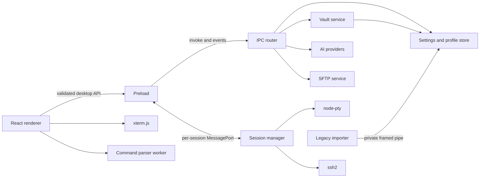

# Geared Term Migration Implementation Plan

> Status: Proposed; implementation has not started
>
> Last updated: 2026-09-19
>
> Governing specification: [`SPEC.md`](SPEC.md)

## 1. Objective and stop condition

This plan describes how to replace Augur Term with the Electron-based Geared Term while keeping the
application usable, testable, and auditable at each stage. It deliberately stops at planning. No
scaffolding, dependency installation, source migration, profile conversion, or product code change
is authorized by this document.

Implementation begins only after the specification and this plan are reviewed and approved.

## 2. Delivery rules

1. Migrate behavior in vertical slices; do not translate Rust files mechanically.
2. Keep the reference application runnable until the replacement release passes its cutover gate.
3. Give every requirement in `SPEC.md` an implementation and verification record.
4. Keep safety, storage, and process-boundary work on the critical path rather than adding it at the
   end.
5. Make terminal, SSH/SFTP, AI, parser, and persistence failures independently recoverable.
6. Keep direct LLM web-page support in a separate workstream and milestone.
7. Use Conventional Commits in English and keep UX changes separate from parity commits.
8. Pin the exact dependency graph that passes CI; do not use unbounded ranges for beta tooling.

## 3. Baseline to freeze before coding

The current analysis used `E:\dev\augur-term` at HEAD
`136c01b34931d9d496ecbc1e1fab66705e281d59`, with additional working-tree changes. That is adequate
for writing the specification but not reproducible enough for acceptance testing.

Phase 0 must produce a baseline manifest containing:

- the exact commit plus patch or a dedicated immutable reference branch/tag;
- Rust toolchain and dependency lockfile;
- supported artifact matrix;
- default config and every persisted schema version;
- a sanitized profile database and import fixtures;
- screenshots or recordings of key focus, shortcut, panel, dialog, and error flows;
- a machine-readable feature and requirement parity matrix;
- exported fixtures from existing Rust unit tests, especially command splitting, WSL, environment,
  vault, history, host-key, and stream parsing tests;
- known reference bugs that must not accidentally become target requirements.

The reference repository remains read-only during the Electron implementation except for an
explicitly reviewed migration-export helper or test-fixture export.

## 4. Target repository layout

The repository should use a pnpm workspace so Electron code, pure domain packages, and tests can be
versioned together without exposing Electron or Node dependencies to pure logic.

```text
apps/
  desktop/
    src/
      main/
        app/
        ai/
        import/
        ipc/
        logging/
        persistence/
        sessions/
        sftp/
        vault/
        windows/
        wsl/
      preload/
      renderer/
        app/
        assistant/
        commands/
        settings/
        sftp/
        terminal/
        workspace/
    resources/
    electron-builder.yml

packages/
  command-parser/
  domain/
  protocol/
  test-support/

tools/
  augur-importer/

tests/
  fixtures/
    ai/
    commands/
    import/
    terminal/
    wsl/
  e2e/
  manual/

docs/
  parity-matrix.md
  architecture-decisions/
  test-matrix.md
```

Rules for the layout:

- `packages/domain` contains serializable domain types and pure state transitions only.
- `packages/protocol` owns runtime schemas and generated/inferred TypeScript DTO types.
- `packages/command-parser` has no React, Electron, provider, terminal, or filesystem dependency.
- `apps/desktop/src/main` is the only production code allowed to touch Node privileged APIs,
  native modules, sockets, credentials, or unrestricted files.
- `preload` is a small adapter over the validated protocol and transferred ports.
- renderer stores contain identifiers and serializable view state, never native handles or xterm
  instances.
- the legacy importer is a separately testable, narrowly scoped compatibility tool, not a general
  Rust sidecar runtime.

## 5. Target architecture



### 5.1 Process ownership

| Concern | Owner | Notes |
| --- | --- | --- |
| Window lifecycle and security | Main | Renderer navigation and new windows are denied by default. |
| PTY, SSH, SFTP, WSL processes | Main | One explicit lifecycle owner per resource. |
| Vault and decrypted secrets | Main | Secret DTOs are never part of the preload API. |
| Provider HTTP and stream decoding | Main | Renderer sees provider-neutral events. |
| xterm instance and addons | Renderer | Stored outside React state; disposed with its view. |
| Workspace and transient UI state | Renderer | Persisted through validated main-process services. |
| Command parsing | Pure package in a worker | Bounded input and conservative fallback. |
| Runtime schemas | Shared protocol package | Validated on both sides of every trust boundary. |

### 5.2 Terminal transport

Use request/response IPC for session creation and lifecycle commands. After creation, transfer a
dedicated `MessagePort` for the terminal's high-frequency data plane.

The port protocol should include:

- `output { sessionId, sequence, chunk }`;
- `input { sessionId, chunk }`;
- `resize { sessionId, cols, rows, revision }`;
- `state { sessionId, sequence, state, detail? }`;
- `ack { sessionId, sequence, bytes }` for flow control;
- `close { sessionId, reason }`.

Binary chunks should use transferable `ArrayBuffer` instances. The main process must cap outstanding
unacknowledged bytes, coalesce adjacent output, and define whether overload pauses the source or
terminates the session with a structured error. It must never silently drop bytes.

### 5.3 Session state machine

All backends should share this state model:

```text
created -> starting -> awaiting-user? -> running -> closing -> closed
                     \-> failed ----------------------^
running -> exited -> closed
```

`awaiting-user` covers host-key and private-key-passphrase prompts. Every transition is idempotent,
sequenced, and testable. SFTP capability is attached only after an SSH session is ready.

### 5.4 Runtime validation

Use a single schema library, preferably Zod, for:

- session profiles and creation requests;
- IPC invokes and events;
- MessagePort envelopes;
- settings and profile files;
- AI stream events;
- command parser input/output;
- import manifests and results;
- structured errors.

The schema package must reject unknown privileged operations and invalid identifiers before a main
service is called. TypeScript types should be inferred from the schemas rather than duplicated.

## 6. Persistence and vault design

### 6.1 Files and transactions

Use main-process-owned, versioned files under the platform-standard Geared Term directories:

| File or directory | Contents |
| --- | --- |
| `config.json` | Non-secret application preferences |
| `profile.json` | Sessions, AI connection metadata, environments, vault-encrypted blobs |
| `ui-state.json` | Window and panel state |
| `known-hosts.json` or compatible store | Parsed host keys and metadata |
| `ai-history/` | Human-readable conversation Markdown |
| `themes/` | User theme JSON |
| `logs/` | Rotated diagnostic logs |

Each mutable JSON file should use write-to-sibling, flush, atomic rename, and a last-known-good
backup or journal. A profile-wide mutation such as master-password rotation must construct and
validate the complete next profile before the atomic swap.

### 6.2 Vault

Implement the vault with Node's audited `crypto` primitives in the main process:

- retain PBKDF2-HMAC-SHA256 compatibility for imported Augur records;
- version KDF parameters so a stronger target KDF can be introduced without ambiguity;
- use AES-256-GCM with unique nonces and purpose-separated authenticated data;
- keep the derived vault key in a zeroable buffer for the unlocked lifetime;
- encrypt each SSH and AI secret independently;
- rebuild all secret blobs transactionally during master-password changes.

For password-free unlock, prefer Electron `safeStorage` when it reports real OS-backed encryption.
On Linux without a usable secret service, either disable the option with an explanation or expose a
clearly labeled, explicit local-key fallback matching the security warning in `SPEC.md`. This choice
must be recorded in an architecture decision before the feature is enabled.

### 6.3 Legacy Redb import

Node should not attempt to reverse-engineer Redb. Build `tools/augur-importer` from the minimal
compatible Rust data, vault, and Redb readers needed for the known legacy schemas.

The import handshake should be:

1. Main detects legacy paths and starts the checksummed helper with no secret arguments.
2. Main sends a protocol version, source paths, and either the master password or explicit approval
   to try the legacy device key through a private framed stdin pipe.
3. The helper validates the vault and reads sessions, AI connections, and environments.
4. The helper returns a length-delimited result over stdout. The result is protected by an ephemeral
   session key or transferred only through inherited private pipes; it is never written to disk.
5. Main validates the complete result, shows non-secret counts and conflicts, encrypts secrets with
   the target vault, and commits one target transaction.
6. Main writes an import receipt containing source fingerprint, target schema, counts, timestamp,
   and no secrets.
7. The helper exits and both processes release plaintext buffers.

Importer tests must cover every legacy `config_version`, flat SSH session compatibility, structured
SSH/local/WSL sessions, legacy single-provider migration, missing/corrupt auto-unlock data, wrong
password, partial records, duplicate IDs, and interrupted target commits.

## 7. Workstreams

The phases below define integration gates, but several workstreams can proceed independently after
their prerequisites are stable.

| Workstream | Depends on | Primary result |
| --- | --- | --- |
| Protocol and security boundary | Foundation | Typed IPC, ports, structured errors |
| Persistence and vault | Protocol | Durable target schemas and secret lifecycle |
| Terminal transport and xterm | Protocol | Local terminal vertical slice |
| Workspace UI | Foundation, domain | Sidebar, tabs, panels, settings |
| SSH and SFTP | Session contract, vault | Remote terminal and file workflow |
| AI and environment | Protocol, vault, terminal snapshots | Provider-neutral streaming assistant |
| Command parser | Foundation only | Pure tested parser and risk metadata |
| Legacy importer | Frozen old schemas, target profile schema | Non-destructive upgrade path |
| Packaging and release | All vertical slices | Supported signed/unsigned artifacts and smoke tests |

No workstream may invent its own identifier, error, cancellation, or persistence conventions.

## 8. Phase 0 - Freeze the reference contract

### Work

- Create the immutable Augur baseline described in Section 3.
- Run the reference unit and platform smoke tests and record the results.
- Build `docs/parity-matrix.md` with every `SPEC.md` requirement ID.
- Record the default focus, shortcut, context-menu, dialog, tab, SFTP, AI, and vault flows.
- Export sanitized byte-exact fixtures rather than copying implementation code.
- Record intentional differences from Section 5 of `SPEC.md` so they are not filed as regressions.
- Establish manual test machines or VMs for Windows x86-64, macOS arm64, and Linux x86-64.

### Exit gate

- The exact reference build is reproducible.
- Every visible feature has a parity-matrix row and acceptance procedure.
- Sanitized legacy import fixtures can be distributed inside the new test suite.
- Open baseline questions are resolved or explicitly block the affected later phase.

## 9. Phase 1 - Repository and secure Electron foundation

### Work

- Initialize the pnpm workspace and the directory structure in Section 4.
- Resolve current compatible versions of Electron, electron-vite 6 beta, TypeScript 7, React,
  xterm.js, `node-pty`, `ssh2`, Vitest, Playwright, and electron-builder; pin the verified graph.
- Configure electron-vite main, preload, and renderer entries.
- Configure TypeScript 7 `noEmit` checks without depending on compiler internals.
- Add formatting, linting, unit tests, build, package, and artifact smoke commands.
- Create the BrowserWindow with context isolation, Node integration disabled, a restrictive CSP,
  navigation/new-window guards, permission denial, and external-link validation.
- Implement the empty contextBridge surface with schema validation and subscription disposal.
- Add structured error primitives and opaque ID generation.
- Add categorized, redacted logging with debug/release paths and 2 MiB rotation.
- Create CI jobs on all three supported operating systems, including packaged-app launch.

### Exit gate

- A blank but secure application packages and launches on every supported platform.
- Renderer probes cannot access Node, Electron internals, arbitrary IPC, or the filesystem.
- The native-module rebuild step is present and verifiable even before `node-pty` is used.
- Typecheck, unit tests, package, and smoke commands run from a clean checkout.

## 10. Phase 2 - Domain, protocol, persistence, and vault

### Work

- Implement branded ID types, session descriptors, settings schemas, environment models, AI
  profiles, structured errors, and state machines in pure packages.
- Implement validated invoke/event routing and per-session MessagePort setup.
- Implement atomic `config.json`, `profile.json`, and `ui-state.json` stores with schema migrations.
- Implement vault create, unlock, lock, secret encrypt/decrypt, master-password rotation, and
  password-free unlock policy.
- Implement renderer-safe profile summaries that never contain encrypted or decrypted secrets.
- Add settings corruption recovery and last-known-good behavior.
- Create target persistence fixtures and property tests for round trips and interrupted writes.
- Freeze the target profile schema needed by the legacy importer.

### Exit gate

- Protocol fuzz/negative tests reject malformed or unauthorized messages.
- Vault lifecycle tests pass, including transactional password rotation and process-local manual
  lock suppression.
- A renderer memory snapshot and IPC trace contain no credential material.
- Corrupt, future-version, and interrupted settings/profile writes have defined outcomes.

## 11. Phase 3 - Local terminal vertical slice and WSL

### Work

- Implement `SessionManager`, the local `node-pty` backend, sequencing, flow control, resize, exit,
  close, and cleanup.
- Implement Windows shell/PATH resolution, Unix shell fallback, macOS login-shell behavior, cwd
  validation, TERM, and true-color environment setup.
- Implement xterm creation outside React state, fit, search, links, Unicode, WebGL fallback, theme,
  resize observer, and deterministic disposal.
- Implement terminal input mappings, selection, copy/paste, read-only mode, context menu, search,
  scrollback, Ctrl+wheel zoom, and exit notice.
- Implement bracketed-paste and multi-line-paste policy.
- Implement terminal snapshot extraction and preview from selection, viewport, and bounded history.
- Implement WSL availability/listing/decoding/state/default/version parsing, quick launch, saved
  session launch arguments, refresh, timeout, environment probe, and terminate confirmation.
- Add real PTY smoke tests on all CI platforms and WSL tests that skip with an explicit reason when
  WSL is unavailable.

### Exit gate

- The packaged app can run a daily-use local shell with correct input, output, resize, Unicode,
  alternate screen, search, and exit handling.
- A ten-megabyte output stress fixture completes without data loss, unbounded queue growth, or React
  reconciliation of terminal chunks.
- Closing a tab reaps its child and leaves no native handle or listener leak.
- WSL discovery and launch pass on a Windows test machine with at least one distribution.

## 12. Phase 4 - Workspace, sessions, settings, appearance, and localization

### Work

- Build the custom chrome, sidebar, grouped session tree, tab strip, terminal/right-panel split,
  collapse handles, divider, toasts, and confirmation dialogs.
- Implement saved SSH/local/WSL forms and editors with type-specific validation.
- Implement tab activation and action-target invariants before wiring privileged actions.
- Implement clean-shutdown UI-state persistence and visible-display restoration.
- Port English and Simplified Chinese catalogs into a typed localization layer.
- Implement settings categories and all non-provider preferences.
- Port built-in themes, user theme loading/reload, font fallback normalization, cursor preferences,
  and coordinated terminal/UI appearance.
- Implement native menus and the shortcut matrix in `SPEC.md`.
- Add keyboard-only and focus regression tests for modals, tabs, panels, and terminal return focus.

### Exit gate

- Local and WSL sessions can be created, grouped, edited, opened, switched, and closed through the
  final workspace shell.
- Layout and appearance survive a clean restart and recover from corrupt/off-screen state.
- Shortcut collisions, dialog leakage into the terminal, and IME behavior complete manual review on
  the three target operating systems.

## 13. Phase 5 - SSH, authentication, and host trust

### Work

- Implement the `ssh2` session adapter under the common session contract.
- Implement password and imported private-key authentication, encrypted-key passphrase prompts, and
  explicit passphrase remembering through the vault.
- Implement persistent and temporary connection modes.
- Implement known-host parsing/storage, serialized updates, unknown-key prompt, changed-key prompt,
  old/new fingerprints, replace/reject behavior, and temporary non-persistence.
- Request and confirm PTY/shell startup, send terminal modes, handle resize/input/output, and map
  exit status versus channel close.
- Add cancellation for connect, prompts, session work, and teardown.
- Implement POSIX-then-Windows environment probing with one bounded deadline.
- Build a controlled `ssh2` test server with deterministic authentication, host keys, PTY, resize,
  shell, exit, disconnect, and exec-channel behavior.

### Exit gate

- Password and encrypted/unencrypted key connections pass against the controlled server and a
  documented interoperability target.
- Unknown, matching, changed, rejected, and temporary host-key scenarios pass without weakening
  trust rules.
- Terminal data remains correct under simultaneous environment probing.
- Closing during DNS/connect/auth/prompt/running states leaves no socket or unresolved prompt.

## 14. Phase 6 - SFTP and directory synchronization

### Work

- Implement an SSH-owned SFTP channel and a cancellable operation/transfer manager.
- Implement remote canonical listing, navigation, refresh, mkdir, rename, recursive delete, file and
  tree upload/download, byte progress, and structured errors.
- Implement the local file pane, Windows drive overview, guarded delete/rename, system open, and
  directory refresh.
- Implement selection/multi-selection rules, menus, dialogs, transfer list, and completion refresh.
- Port optimistic `cd` tracking as a pure state machine with shell-line fixtures.
- Pause sync during alternate-screen use, support detach/re-enable, and implement a bounded,
  guaranteed-cleanup re-sync strategy.
- Implement configurable remote-file commands with shell-appropriate quoting and control-character
  rejection.
- Add SFTP font zoom and right-panel compact layouts.

### Exit gate

- Every file operation passes against the controlled SFTP server for files, directories, Unicode
  names, errors, and cancellation.
- Terminal I/O remains responsive during large transfers and failed SFTP operations.
- Sync never injects a probe into an alternate-screen program and never leaves echo disabled.
- Destructive local and remote actions pass confirmation and protected-root tests.

## 15. Phase 7 - AI providers, environment context, and history

### Work

- Implement main-process Chat Completions and Responses adapters with URL normalization, endpoint
  consent, optional bearer auth, timeouts, size limits, cancellation, and structured errors.
- Port provider-neutral stream events, reasoning, activity, sources, usage, and Responses
  continuation state.
- Implement model discovery and connection tests without exposing API keys to renderer state.
- Implement environment records, automatic probes, confirmation/edit/conflict flows, prompt preview,
  and per-session attachment settings.
- Implement deterministic system/user content construction and terminal-snapshot untrusted-data
  guards.
- Build the assistant panel, composer, model/options selectors, privacy confirmation, incremental
  Markdown, pinned scrolling, reasoning/activity UI, errors, and Stop/New Chat.
- Implement versioned Markdown conversation history, load/continue/delete/open-folder behavior, and
  malformed-file isolation.
- Test providers with local HTTP fixtures; external paid endpoints are optional manual
  interoperability tests and must never be required for CI.

### Exit gate

- Both provider protocols pass streaming, non-streaming where supported, cancel, timeout, malformed
  event, size, error, usage, source, and continuation fixtures.
- Endpoint consent occurs before the first request and is invalidated by endpoint changes.
- Snapshot, prompt, response, reasoning, and key content are absent from logs and renderer-accessible
  secret state.
- AI failure under load does not affect PTY, SSH, or SFTP traffic.

## 16. Phase 8 - Command parser and trusted actions

### Work

- Import the old command-splitting fixtures as behavioral inputs, not Rust code.
- Define parser output containing shell, exact text, display text, comments, multiline flag,
  confidence, completeness, revision, risk hints, and fallback reason.
- Implement separate Bash-family and PowerShell scanners/parsers. Add CMD/fish support only to the
  confidence level justified by fixtures.
- Run parsing in a worker with input, time, nesting, and output limits.
- Implement streaming revisions and stability gating so stale buttons cannot act.
- Build command cards with Copy, primary Insert, secondary Run, disabled reasons, target session,
  feedback, and accessible names.
- Implement main-process target/session/revision validation for Insert and Run.
- Implement exact newline normalization, unsupported-control rejection, Run deduplication, and
  high-risk confirmation/Insert-only outcomes.
- Retire `ai_insert_auto_enter` and add an import/release notice explaining the safer action model.

### Exit gate

- Old fixtures pass or have a documented safer fallback; expanded Bash and PowerShell fixtures pass.
- Insert sends no submission sequence in every shell and platform test.
- Run sends exactly one submission only for a complete, current, explicitly selected candidate.
- Tab switches, session closes, response revisions, double-clicks, and delayed IPC cannot redirect or
  duplicate a command.
- Parser failure cannot crash or block the renderer.

## 17. Phase 9 - Legacy import, hardening, packaging, and cutover

### Work

- Implement the legacy importer handshake in Section 6.3.
- Import config, UI state, sessions/secrets, AI connections, environments, known hosts, history, and
  themes with preview, conflict resolution, idempotence, and receipts.
- Run dual-application acceptance against the frozen reference baseline and close every parity row.
- Execute sustained terminal output, long scrollback, rapid resize, multiple concurrent sessions,
  SFTP transfer, AI streaming, suspend/resume, network loss, renderer crash, and WebGL loss tests.
- Audit renderer bundle imports, CSP, IPC exposure, external URL handling, redaction, dependency
  advisories, and native module packaging.
- Produce Windows x86-64, macOS arm64, and Linux x86-64 artifacts and execute installed/packaged
  smoke tests rather than unpackaged development tests only.
- Prepare migration documentation, backup/rollback instructions, known limitations, and a support
  checklist starting with `debug.log` and then the subsystem log.
- Keep Augur Term available read-only for rollback through at least the first replacement release.

### Exit gate

- All eleven replacement criteria in `SPEC.md` Section 25 have evidence.
- Import succeeds from every sanitized legacy fixture, fails safely on corrupt/wrong-password input,
  and leaves the source untouched.
- There are no unwaived MUST gaps or blocker defects.
- Package smoke tests prove `node-pty`, SSH, settings, vault, and renderer security on every artifact.
- Cutover and rollback are documented and rehearsed before Geared Term becomes the primary release.

## 18. Test strategy

### 18.1 Test layers

| Layer | Tooling | Scope |
| --- | --- | --- |
| Pure unit | Vitest | Domain state, parser, schemas, URL building, settings migrations |
| Main integration | Vitest in Node/Electron harness | Vault, stores, PTY, SSH/SFTP, AI adapters, importer protocol |
| Renderer component | Vitest plus DOM testing utilities | Focus, command cards, settings, panel state |
| Electron E2E | Playwright | Window, preload boundary, terminal workflows, dialogs, tabs |
| Package smoke | Platform CI scripts | Installed/packaged launch and native module execution |
| Manual | Versioned checklists | IME, DPI, fonts, multiple displays, platform chrome, accessibility |

### 18.2 Determinism

- Network tests use local controlled servers and byte-exact fixtures.
- Timeouts use injectable clocks where possible.
- IDs and timestamps use test providers.
- Terminal tests compare byte streams and normalized buffer snapshots, not screenshots alone.
- Visual baselines supplement behavioral assertions; they do not replace them.
- Secrets in fixtures are synthetic and visibly marked as non-production.

### 18.3 Required CI order

1. formatting and repository checks;
2. TypeScript `noEmit` typecheck;
3. pure unit and schema tests;
4. main integration tests;
5. renderer tests;
6. platform PTY and SSH/SFTP smoke tests;
7. Electron build;
8. package creation and native module rebuild;
9. packaged-app smoke tests;
10. artifact upload only after every prior gate succeeds.

## 19. Commit and review strategy

- Use small Conventional Commits, for example `feat(terminal): add sequenced PTY transport` or
  `test(import): cover legacy WSL sessions`.
- Keep generated lockfile updates in the same change as the dependency decision that requires them.
- Require an architecture decision record for process-boundary changes, persistence formats,
  auto-unlock policy, and parser execution policy.
- Require security review for preload additions, new IPC operations, URL handling, secret access,
  process spawning, filesystem scope, and command execution paths.
- Require package smoke evidence when Electron, Node ABI, `node-pty`, electron-builder, or signing
  configuration changes.
- Do not mix parity behavior and visual redesign in the same commit or review.

## 20. Risk register

| Risk | Detection | Mitigation | Release blocker |
| --- | --- | --- | --- |
| electron-vite 6 beta regression | Clean build/package failure or HMR/main mismatch | Pin an exact beta, keep a minimal reproduction, upgrade separately | Package or production build failure |
| TypeScript 7 tooling gap | Lint/plugin/compiler API errors | Keep TS as typechecker, isolate incompatible non-blocking tooling | Typecheck or source-map correctness failure |
| `node-pty` ABI/package failure | Packaged PTY smoke fails | Rebuild for Electron ABI on each platform and test artifact | Any supported artifact cannot start a PTY |
| xterm font/IME regression | Manual matrix or buffer/render mismatch | Font fallback fixtures, IME testing, WebGL fallback | Input loss, unreadable CJK, or incorrect cell geometry |
| Port backpressure bug | Memory growth, latency, missing sequence | Credit/ack protocol, stress tests, explicit overload state | Lost terminal bytes or unbounded growth |
| `ssh2` parity gap | Controlled-server scenario fails | Adapter state machine, interoperability fixtures, scoped feature set | Auth, host trust, PTY, or resize failure |
| SFTP blocks terminal | Latency/stress metrics | Separate channels/tasks and bounded transfer events | Terminal becomes unresponsive during transfer |
| Changed-host handling weakens | Host-key fixtures fail | Fail closed, serialize store changes, show both fingerprints | Mismatch accepted without explicit approval |
| Parser changes command meaning | Fixture/fuzz failure | Shell-specific parsers and whole-block fallback | Runnable incorrect candidate |
| Stale command targets wrong tab | Race E2E failure | Session and revision validation in main | Any demonstrated cross-session send |
| Legacy Redb import corrupts data | Fixture or interrupted-commit test fails | Read-only source, preview, atomic target commit, receipt | Source mutation, secret loss, or non-idempotence |
| Secret leakage | Log/IPC/bundle scanning | Main-only secrets, redaction, synthetic canary tests | Any plaintext secret outside approved memory path |
| Linux auto-unlock is weak | `safeStorage` reports basic backend | Disable or require explicit warned fallback | Silent insecure auto-unlock |
| Feature creep from Web integration | Dependency or IPC review | Separate milestone and capability boundary | Web content obtains terminal capability |

## 21. Progress reporting

During implementation, the parity matrix is the primary status artifact. Each phase report should
contain:

- requirements closed since the previous report;
- automated and manual evidence links;
- new or changed architecture decisions;
- known gaps and whether they block the current exit gate;
- dependency or platform changes;
- security-sensitive boundary changes;
- the next smallest vertical slice.

Percent-complete estimates should not replace requirement evidence or phase exit gates.

## 22. Approval checklist before implementation

- [ ] `SPEC.md` product scope and intentional differences are accepted.
- [ ] The exact Augur Term reference baseline can be frozen without losing local work.
- [ ] Product naming, application IDs, data-directory names, and package names are confirmed.
- [ ] The three-platform artifact matrix is confirmed.
- [ ] The target vault and Linux auto-unlock policy are approved.
- [ ] The Rust compatibility helper is approved as a temporary migration-only component.
- [ ] The retirement behavior for `ai_insert_auto_enter` is approved.
- [ ] The no-terminal-splits parity scope is accepted.
- [ ] Direct LLM web-page support remains a separate milestone.
- [ ] Phase 0 may begin.
