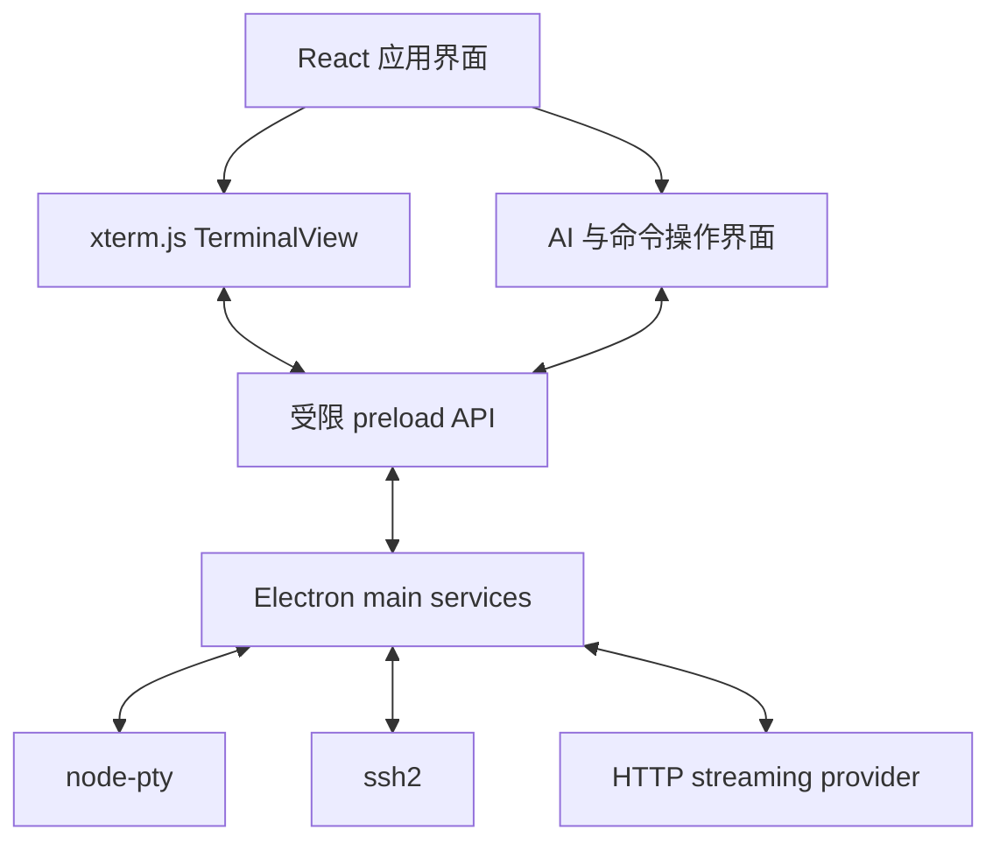
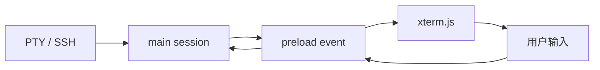

# Rust 终端项目迁移至 Electron 的详细设计方案

> 文档类型：技术路线与产品/UX 等价迁移设计  
> 状态：初稿  
> 更新时间：2026-09-19

## 1. 文档目的

本方案用于把现有 Rust 桌面终端项目迁移为 Electron + TypeScript 技术栈。

这里的“迁移”不是逐文件、逐类型或逐实现翻译，而是：

- 以旧项目已存在的功能、交互流程和视觉/UX 规则为产品基准；
- 重新划分 Electron 主进程、preload 与 React renderer 的职责；
- 用 xterm.js 取代自维护或 Rust 侧的终端渲染/模拟层；
- 用 Node.js 生态实现 PTY、SSH、文件访问、网络流和系统集成；
- 保留旧项目的 AI HTTP streaming、终端 buffer 上下文、Shell 代码块解析和命令操作体验；
- 在达到功能等价后，再独立演进，不在迁移阶段顺带重做产品。

直接嵌入真实 LLM Web 页面的新功能不属于本迁移基线，见另一份《直接 Web 页面支持需求规格》。

## 2. 迁移目标

### 2.1 核心目标

1. **功能等价**：旧项目当前可见功能均有明确去向，不因换栈静默丢失。
2. **UX 等价**：快捷键、焦点切换、滚动、选择、复制、粘贴、命令插入、命令执行、流式回答及错误反馈等关键行为保持一致。
3. **终端可靠**：本地 shell、PTY I/O、resize、Unicode、颜色、链接、搜索、滚动历史和高 DPI 显示可用于日常开发与运维。
4. **边界清晰**：xterm.js 只负责终端状态机与显示；会话、连接、AI、命令、工作区等业务状态由应用拥有。
5. **安全默认**：renderer 不直接获得 Node.js、文件系统、`child_process` 或任意 IPC 能力。
6. **便于继续魔改**：新增远程会话、浏览器面板、编辑器、工作区、MCP 或 agent 时，不需要推翻终端核心。

### 2.2 非目标

- 不重写 terminal emulator core。
- 不在首轮迁移中把产品改造成自治 agent。
- 不要求通过 shell hooks 建立完整的命令语义数据库。
- 不在首轮迁移中支持任意网页的 DOM 集成。
- 不为了“更现代”而改变旧项目已验证的 UX。
- 不把 Rust 源码结构机械映射成 TypeScript 目录结构。

## 3. 技术基线

### 3.1 技术选型

| 层 | 选择 | 角色 |
|---|---|---|
| 桌面运行时 | 最新稳定版 Electron | Chromium UI、Node.js 主进程、桌面窗口与系统能力 |
| 语言 | TypeScript 7+ | 主进程、preload、renderer 和共享协议 |
| 构建 | electron-vite 6 beta | Electron 多入口构建、renderer HMR、main/preload reload |
| UI | 最新稳定版 React + React DOM | 应用 chrome、面板、设置、AI 视图、命令操作 UI |
| 终端 | `@xterm/xterm` | VT 状态机、屏幕 buffer、选择、渲染与输入事件 |
| 本地 PTY | `node-pty` | 本地 shell/ConPTY 启动和双向字节流 |
| SSH | `ssh2` | 远程 shell、认证、resize；后续按需扩展转发与 SFTP |
| 打包 | `electron-builder` | Windows/macOS/Linux 产物、native module rebuild 与签名流程 |
| 单元测试 | Vitest | parser、状态、协议和纯逻辑测试 |
| UI/集成测试 | Playwright | renderer 与打包应用的关键路径回归 |

### 3.2 “最新”版本策略

“最新”是安装策略，不应成为文档里的永久硬编码版本号：

1. 初始化迁移分支时解析并记录当日目标版本；
2. `package.json` 与 lockfile 固定实际构建过的精确依赖图；
3. Electron、electron-vite、Vite、React、TypeScript、xterm.js 与 `node-pty` 作为一组做升级验证；
4. beta 构建工具不使用无上限浮动范围；electron-vite 6 beta 固定到已验证的具体 beta 版本；
5. Electron major 升级必须重跑 PTY、preload、打包和跨平台 smoke test；
6. xterm.js core 与 addons 保持同一发布系列。

### 3.3 TypeScript 7 的特殊约束

TypeScript 7 采用原生编译器路线。迁移工程只把它作为类型检查器和语言服务使用，不依赖其内部 compiler API：

- renderer 的 TS/TSX 转换由 electron-vite/Vite 构建链完成；
- CI 独立运行 TypeScript 7 的 `noEmit` 类型检查；
- ESLint、typed lint、API Extractor 或代码生成器如仍依赖旧 compiler API，应单独验证兼容性；
- 若某个开发期工具暂未支持 TS7，不应把应用源码降回旧语法，可临时把该工具隔离到非阻塞检查或使用其兼容版本；
- 不允许在构建脚本中导入 TypeScript 的未公开内部模块。

## 4. 迁移原则

### 4.1 以行为契约为单位迁移

对旧项目先建立 feature inventory。每项记录：

- 用户入口；
- 正常路径；
- 键盘与鼠标行为；
- 状态持久化；
- 错误、取消与重试；
- 平台差异；
- 可观察输出；
- 对应验收用例。

迁移完成的定义是行为契约通过，而不是 TypeScript 侧出现了“同名模块”。

### 4.2 先等价、后优化

第一阶段保留旧 UX，包括即使某些交互未来可能重新设计。任何 UX 变化必须独立记录，不能混在技术迁移提交中。

### 4.3 字节流与业务状态分离

PTY/SSH 输出同时服务于：

- xterm.js 渲染；
- 可选的有限缓冲与诊断；
- AI 上下文采集。

xterm.js 的屏幕 buffer 是“用户当前看到什么”的权威来源，但不是 Workspace、Session、Connection、Command 或 AI Conversation 的应用数据库。

## 5. 总体架构



### 5.1 Electron main process

负责所有高权限和长生命周期资源：

- 窗口及应用生命周期；
- 本地 PTY 创建、写入、resize、终止与退出监听；
- SSH 连接和远程 shell channel；
- AI HTTP 请求、流式响应、取消和凭据读取；
- 配置、会话恢复数据和必要的文件访问；
- IPC 请求验证、路由和事件分发；
- 崩溃日志与非敏感诊断。

main process 不负责 React 视图状态，也不操作 xterm.js 实例。

### 5.2 preload

preload 是 renderer 与 main 的最小能力边界：

- 只暴露按业务命名、参数可验证的 API；
- 不暴露原始 `ipcRenderer`；
- 不暴露任意 channel、任意文件路径执行或任意进程启动；
- 所有订阅 API 返回明确的 unsubscribe/dispose；
- 二进制终端数据使用可预测的编码或 transferable 数据，不隐式做文本转换。

### 5.3 React renderer

负责：

- 应用布局和 pane 状态；
- xterm.js 实例及 addon 生命周期；
- 终端选择、viewport/scrollback 上下文读取；
- AI 流式消息的展示状态；
- Shell 代码块解析结果的 UI；
- Copy、Insert、Run 的用户交互；
- 可撤销的纯 UI 设置和本地视图状态。

renderer 不直接创建 PTY、SSH 连接或读取秘密凭据。

## 6. 核心领域模型

### 6.1 TerminalSession

所有终端后端使用统一会话契约：

```ts
type SessionId = string

interface TerminalSize {
  cols: number
  rows: number
}

interface TerminalSession {
  readonly id: SessionId
  readonly kind: 'local-pty' | 'ssh'

  write(data: Uint8Array): void
  resize(size: TerminalSize): void
  close(reason?: string): Promise<void>

  onData(listener: (data: Uint8Array) => void): Disposable
  onExit(listener: (event: SessionExit) => void): Disposable
}
```

实现至少包括：

- `LocalPtySession`：封装 `node-pty`；
- `SshSession`：封装 `ssh2` shell channel。

xterm.js 只与统一 session transport 交互，不根据本地或远程会话分支渲染逻辑。

### 6.2 应用拥有的对象

建议明确拥有以下对象，而不是从 terminal buffer 反推：

- `Workspace`：布局、打开的 pane、活动对象；
- `TerminalTab`：UI tab/split 信息和关联的 session；
- `SessionDescriptor`：创建参数与可恢复元数据；
- `ConnectionProfile`：本地 shell 或 SSH 配置引用；
- `AiConversation`：provider、model、消息、请求状态；
- `CommandCandidate`：解析后的可操作命令；
- `TerminalContextSnapshot`：用户主动提交给 AI 的有限屏幕上下文。

## 7. IPC 与协议设计

### 7.1 协议原则

- request/response 与 event 分开命名；
- 所有 payload 在边界处做 runtime validation；
- 错误使用结构化 code，不把任意异常对象跨进程传输；
- session 事件携带 `sessionId` 和单调序号，便于处理关闭后的迟到数据；
- renderer reload 时 main 可清理孤儿订阅，但不得无条件杀死用户要求保留的 session；
- 高频终端数据不得走大量逐字符 invoke。

### 7.2 建议 API

```ts
interface DesktopApi {
  terminal: {
    create(profile: SessionProfile): Promise<SessionCreated>
    write(sessionId: SessionId, data: Uint8Array): void
    resize(sessionId: SessionId, size: TerminalSize): void
    close(sessionId: SessionId): Promise<void>
    onData(listener: (event: SessionData) => void): Disposable
    onExit(listener: (event: SessionExit) => void): Disposable
  }

  ai: {
    start(request: AiRequest): Promise<RequestId>
    cancel(requestId: RequestId): Promise<void>
    onDelta(listener: (event: AiDelta) => void): Disposable
    onComplete(listener: (event: AiComplete) => void): Disposable
    onError(listener: (event: AiError) => void): Disposable
  }

  settings: {
    get(): Promise<AppSettings>
    patch(patch: SettingsPatch): Promise<AppSettings>
  }
}
```

`Insert` 与 `Run` 不需要成为暴露给第三方内容的能力。在本迁移基线中，它们由可信 React UI 把命令写入当前 session：

- Insert：发送命令文本，不发送回车；
- Run：发送命令文本，并在用户明确点击后发送对应 shell 的提交按键序列。

## 8. 终端子系统设计

### 8.1 xterm.js 生命周期

每个 `TerminalView`：

1. 创建一个 `Terminal` 实例；
2. 加载核心 addons；
3. 挂载到 pane DOM；
4. 绑定 session data、terminal input 和 resize；
5. pane 隐藏/恢复时重新 fit；
6. unmount 时解除所有监听并按产品策略保留或关闭 session。

建议首批 addons：

- WebGL renderer，失败时回退到默认 renderer；
- fit；
- search；
- web links；
- serialize（仅在确有恢复/导出需求时启用）；
- Unicode grapheme/Unicode 支持；
- ligatures（按用户设置启用）。

### 8.2 数据路径



约束：

- PTY/SSH 输出保持原始字节含义；
- 不把 renderer 的 DOM 当作 terminal 文本来源；
- resize 合并短时间内的抖动，但最终尺寸必须送达后端；
- session close/exit 是幂等过程；
- 断连、进程退出和用户关闭必须在 UI 上可区分。

### 8.3 buffer 上下文

AI 默认上下文来源于 xterm.js active buffer，而不是 DOM：

- 当前 selection（若存在）；
- 当前 visible viewport；
- viewport 之前用户配置的有限行数；
- 可选的会话类型、终端尺寸和人工填写的说明。

默认不发送完整 scrollback。采集前提供可见预览或明确范围提示，保证“AI 大致看到用户当前看到的内容”这一心理模型成立。

需要分别处理：

- normal buffer 与 alternate buffer；
- wrapped line；
- 空白裁剪；
- ANSI 样式不进入纯文本上下文；
- selection 优先级；
- 最大字符/行数和截断提示。

### 8.4 本地 shell

需从旧项目迁移并验证：

- 默认 shell 探测与用户 profile；
- Windows ConPTY；
- PowerShell、CMD、WSL、Git Bash 等旧项目已支持组合；
- macOS/Linux 的 login shell 与环境继承；
- cwd、环境变量、启动命令；
- shell 不存在、权限不足、启动失败的错误反馈；
- 退出码和异常终止。

支持矩阵以旧项目当前能力为最低线，不在本文凭空扩大平台承诺。

### 8.5 SSH

SSH 与 terminal renderer 解耦。首轮只迁移旧项目已具备的能力；如旧项目具有下列功能，则逐项建立验收：

- host/port/user；
- password、private key、agent 等认证；
- known-host/fingerprint 决策；
- keepalive 与超时；
- PTY type 与 resize；
- 断线、重连和错误提示；
- jump host、端口转发或 SFTP（只有旧项目已有时才进入等价范围）。

凭据不得进入 renderer 持久状态、日志或崩溃报告。

## 9. AI HTTP streaming 等价迁移

### 9.1 保留的产品行为

- 用户主动把终端 selection 或有限 buffer 上下文发送给 AI；
- 请求通过 HTTP streaming 返回；
- UI 增量显示文本与代码块；
- 用户可取消请求；
- 网络错误、鉴权错误、限流和 provider 错误可区分；
- 未完成的代码块不会被当作稳定、可直接执行的最终命令；
- conversation 的保留范围与旧项目一致。

### 9.2 provider 抽象

```ts
interface AiProvider {
  start(
    request: AiRequest,
    signal: AbortSignal,
  ): AsyncIterable<AiStreamEvent>
}
```

统一事件建议包含：

- `message-start`；
- `text-delta`；
- `message-complete`；
- `usage`；
- `provider-error`。

provider 特有 wire format 只存在于 main process adapter，React 不解析供应商原始 SSE/JSON chunk。

## 10. Shell 代码块与命令操作

### 10.1 行为基线

只对明确或高置信度识别为 Shell 的 fenced code block 自动拆分，例如：

- `sh`、`shell`、`bash`、`zsh`、`fish`；
- `powershell`、`pwsh`；
- Windows command script（若旧项目支持）。

解析输出至少包含：

```ts
interface ParsedCommand {
  id: string
  shell: ShellKind
  text: string
  displayText: string
  leadingComments: string[]
  multiline: boolean
  confidence: 'explicit' | 'inferred'
}
```

每个独立命令提供：

- Copy；
- Insert；
- Run。

注释与命令分开展示，但注释不应无条件丢弃；它们通常是该命令的用途说明。

### 10.2 拆分语义

“独立命令”定义为可单独提交的 top-level shell statement，不是单行文本。至少正确处理：

- 反斜杠/PowerShell backtick 续行；
- 引号；
- 管道、`&&`、`||`；
- subshell、`$()`、括号与代码块；
- heredoc；
- `for`/`while`/`if` 等复合结构；
- 多行环境变量前缀；
- 空行与前导注释。

Bash-family 与 PowerShell 使用独立解析策略。无法高置信度拆分时，宁可保留整个代码块为一个候选，也不产生可能改变语义的碎片。

### 10.3 Run 安全 UX

- Insert 是默认主操作；
- Run 必须来自可信应用 UI 的明确用户动作；
- streaming 尚未完成或代码块仍变化时禁用 Run；
- 对明显高风险命令给出额外确认或仅允许 Insert；
- 风险匹配只用于 UX 提醒，不宣称是安全沙箱；
- multiline command 在发送前保持原始换行与 quoting；
- 操作目标始终显示为当前活动 session，切换 session 后不得误发给旧 session。

## 11. React UI 与状态管理

### 11.1 状态分类

| 状态 | 所有者 | 示例 |
|---|---|---|
| 高权限资源 | main | PTY、SSH socket、API credential |
| 共享业务状态 | renderer store + main persistence | tabs、profiles、layout、active session |
| 终端显示状态 | xterm.js | cursor、screen、scrollback、selection |
| 临时 UI 状态 | React component/store | dialog、hover、当前输入、streaming indicator |
| 协议 DTO | shared package | IPC request/event/error |

不要把 xterm.js 实例、WebContents 或 Node handle 放进可序列化全局 store。

### 11.2 UX 等价检查重点

- 启动后默认焦点位置；
- terminal 与 AI pane 的焦点切换；
- 快捷键冲突和系统保留快捷键；
- 中文输入法/IME；
- selection 后右键与复制行为；
- 粘贴多行文本提示；
- terminal resize 时不跳帧或错位；
- AI streaming 时滚动锁定策略；
- command row 更新时不抢焦点；
- dark/light theme 与 terminal theme 同步；
- 高 DPI、缩放和字体 fallback。

## 12. 推荐目录结构

```text
src/
  main/
    app/
    windows/
    sessions/
      terminal-session.ts
      session-manager.ts
      local-pty-session.ts
      ssh-session.ts
    ai/
      provider.ts
      stream-controller.ts
      providers/
    settings/
    ipc/
      handlers.ts
      validation.ts

  preload/
    index.ts
    desktop-api.ts

  renderer/
    app/
    workspace/
    terminal/
      TerminalView.tsx
      addons.ts
      buffer-context.ts
    ai/
    commands/
      CommandBlock.tsx
      CommandRow.tsx
    settings/
    state/

  shared/
    protocol/
    domain/
    errors/

packages/
  command-parser/
    src/
      bash.ts
      powershell.ts
      types.ts
```

如果项目规模暂时较小，`packages/command-parser` 可先位于 `src/shared`；但 parser 必须保持与 React、Electron 和网络 provider 无关。

## 13. 安全设计

必须启用或保持：

- `contextIsolation: true`；
- `nodeIntegration: false`；
- renderer sandbox（在 native/功能约束允许的情况下）；
- CSP；
- 导航、新窗口、下载与外部链接的 allowlist/确认策略；
- IPC 参数 runtime validation；
- secret 不经 renderer；
- 日志脱敏；
- 依赖与 Electron 安全更新节奏；
- 外部 URL 使用系统浏览器前进行 scheme 验证。

即使第一阶段尚未嵌入第三方网页，也应按未来可能存在不可信 WebContents 的安全标准建立能力边界。

## 14. 配置与持久化

建议持久化：

- UI theme、字体、字号、line height；
- terminal behavior；
- profiles（不含明文秘密）；
- workspace layout；
- 最近 session 的可恢复描述；
- AI provider 非敏感设置；
- buffer 上下文范围；
- command Run 风险 UX 设置。

不建议持久化：

- xterm.js 内部对象；
- 活 PTY/SSH handle；
- 无限制完整 scrollback；
- 明文 token、password 或 private key passphrase；
- 未经用户知情的终端内容副本。

配置 schema 带版本号并提供向前迁移。设置损坏时回退到安全默认值，同时保留可诊断错误。

## 15. 测试策略

### 15.1 单元测试

- Bash-family 和 PowerShell 命令拆分 fixture；
- 注释归属；
- heredoc、续行、复合语句和不完整 streaming block；
- buffer 行拼接、wrapped line、截断；
- IPC schema validation；
- provider stream 解码和取消；
- settings migration。

### 15.2 集成测试

- fake session 的输入、输出、resize、exit；
- node-pty 本地 smoke test；
- SSH test server 的认证、resize、断开；
- main/preload/renderer IPC；
- Insert 不发送 Enter，Run 恰好发送一次提交；
- 活动 session 切换期间不会串写。

### 15.3 E2E 与人工回归

- 启动、开关 tab/split、恢复 workspace；
- 本地 shell 与旧项目支持的主要平台组合；
- Unicode、CJK、emoji、Nerd Font/Powerline；
- alternate screen：vim、less、top/tmux 类场景；
- 大量输出、长 scrollback、快速 resize；
- AI streaming、取消、错误与重试；
- 代码块逐步完成期间 Run 状态；
- 安装包内 native module 可用；
- 系统缩放与多显示器。

## 16. 性能与可靠性预算

- 高频 terminal data 使用批量写入，避免逐字符 React state 更新；
- terminal output 不进入 React reconciliation；
- AI markdown/代码块解析按增量或节流策略更新；
- parser 对单个异常大代码块设上限并可降级为整块展示；
- main 中每个 session 有独立生命周期和背压策略；
- renderer reload、窗口关闭、系统休眠和网络切换均有明确定义；
- WebGL context lost 时可恢复或回退；
- 不因 AI provider 故障影响 terminal I/O。

## 17. 迁移阶段

### Phase 0：旧项目盘点与基线冻结

产物：

- 功能/UX inventory；
- 平台支持矩阵；
- 快捷键表；
- 设置 schema；
- 关键流程录屏或截图；
- parser fixtures；
- 旧项目可重复运行的验收清单。

### Phase 1：Electron 骨架与安全边界

- Electron + electron-vite 6 beta + React + TypeScript 7；
- main/preload/renderer 三入口；
- 安全 webPreferences；
- typed IPC 与错误协议；
- CI、lint/typecheck/test/package smoke test。

### Phase 2：本地终端垂直切片

- `node-pty` session；
- xterm.js renderer 与 addons；
- input/output/resize/exit；
- 字体、主题、复制粘贴、搜索；
- 一个可日用的本地 shell pane。

### Phase 3：旧终端 UX 与会话模型

- tabs/splits/workspace；
- profiles 与设置；
- session lifecycle；
- 恢复行为；
- 平台特性和快捷键等价。

### Phase 4：AI streaming 与 buffer 上下文

- provider adapter；
- context snapshot；
- streaming UI、取消与错误；
- 隐私范围和截断提示。

### Phase 5：命令 parser 与操作 UI

- 移植旧 parser fixtures；
- Bash-family/PowerShell 拆分；
- 注释展示；
- Copy/Insert/Run；
- streaming 稳定状态与风险提醒。

### Phase 6：SSH 与旧功能补齐

- `SshSession`；
- 认证、host verification、resize、退出；
- 只按旧项目能力补齐高级功能；
- 跨平台打包验证。

### Phase 7：切换与清理

- 双版本对照测试；
- 导入旧设置（如需要）；
- 缺陷收敛；
- 标记 Rust 版本只读；
- Electron 版本成为主线。

## 18. 功能映射工作表

迁移开始时使用下表逐项填充，不允许以“应该差不多”关闭条目：

| 旧项目能力 | 旧 UX/边界 | 新模块 | 自动测试 | 人工验收 | 状态 |
|---|---|---|---|---|---|
| 本地 terminal | 待盘点 | `LocalPtySession` + `TerminalView` | 待补 | 待补 | 未开始 |
| SSH terminal | 待盘点 | `SshSession` | 待补 | 待补 | 未开始 |
| buffer 发给 AI | selection/viewport/有限历史 | `buffer-context` | 待补 | 待补 | 未开始 |
| HTTP streaming | 待盘点 provider 与错误 UX | `ai/providers` | 待补 | 待补 | 未开始 |
| Shell block 解析 | 注释隔离、独立命令 | `command-parser` | fixture 迁移 | 对照旧 UI | 未开始 |
| Copy | 单条命令 | `CommandRow` | 待补 | 待补 | 未开始 |
| Insert | 不回车 | `CommandRow` + active session | 必须 | 必须 | 未开始 |
| Run | 用户点击后回车 | `CommandRow` + active session | 必须 | 必须 | 未开始 |

## 19. 验收标准

迁移版本只有同时满足以下条件才可替代 Rust 版本：

1. 旧项目 inventory 中所有“必须迁移”条目均有测试或人工验收证据；
2. 本地 terminal 与 SSH 的输入、输出、resize、exit 无已知阻塞缺陷；
3. Copy、Insert、Run 的行为与目标 session 一致，Insert 永不隐式回车；
4. Shell parser 旧 fixture 全部通过，新增的 multiline/streaming 边界用例通过；
5. AI buffer 上下文范围可预测，默认不上传完整历史；
6. renderer 无 Node.js 直接访问，无任意 IPC 暴露；
7. 打包产物中的 `node-pty` 在目标平台实际运行；
8. 快捷键、焦点、IME、Unicode、alternate screen 与高 DPI 完成回归；
9. 关闭、崩溃、取消、断网、SSH 断开和 provider 错误均有可恢复或明确终态；
10. Web 页面直连能力未被偷偷耦合进本迁移核心。

## 20. 主要风险与处理

| 风险 | 影响 | 处理 |
|---|---|---|
| electron-vite 6 为 beta | 构建或打包回归 | 固定具体 beta；保留最小复现；升级单独验证 |
| TypeScript 7 工具生态过渡 | typed lint/插件不兼容 | 不依赖 compiler API；类型检查与 lint 解耦 |
| `node-pty` native module | 安装包运行失败 | CI 做 rebuild 和真实打包 smoke test |
| Electron 安全边界配置错误 | 高权限暴露 | context isolation、最小 preload、IPC validation |
| terminal 输出拖慢 React | 卡顿 | 输出直写 xterm，不进入 React state |
| parser 改变命令语义 | 错误执行 | fixture 驱动；低置信度整块保留；Insert 优先 |
| 迁移期间顺带重做 UX | 范围失控 | 等价迁移与产品改版分支/里程碑分离 |
| 跨平台行为差异 | 难以替代旧版本 | 以旧支持矩阵为验收下限，平台 CI + 人工回归 |

## 21. 版本核对参考

以下链接用于初始化时核对当日版本和兼容性，不替代 lockfile：

- Electron 官方文档与发布信息：https://www.electronjs.org/docs/latest/
- electron-vite 官方文档：https://electron-vite.org/
- electron-vite releases：https://github.com/alex8088/electron-vite/releases
- TypeScript 官方博客：https://devblogs.microsoft.com/typescript/
- React 官方文档：https://react.dev/
- xterm.js 官方站点：https://xtermjs.org/
